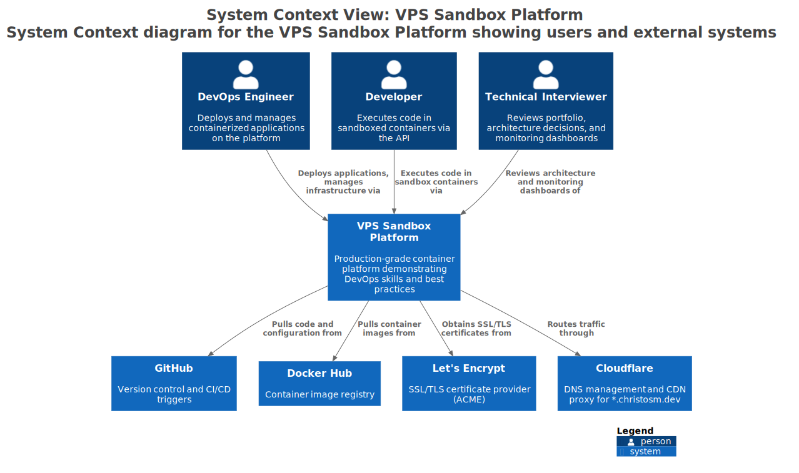
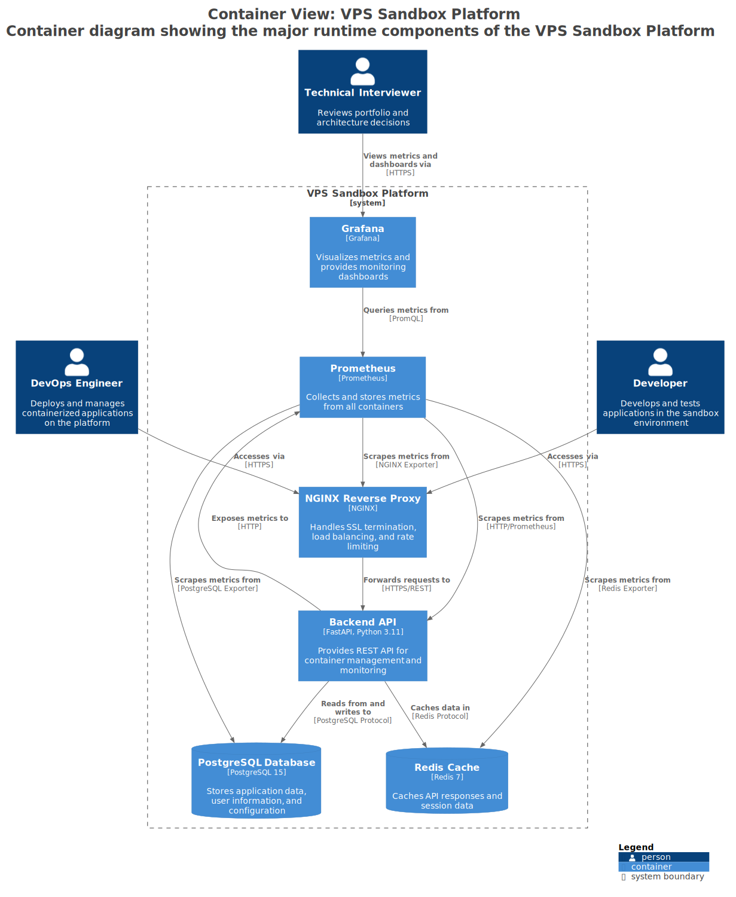
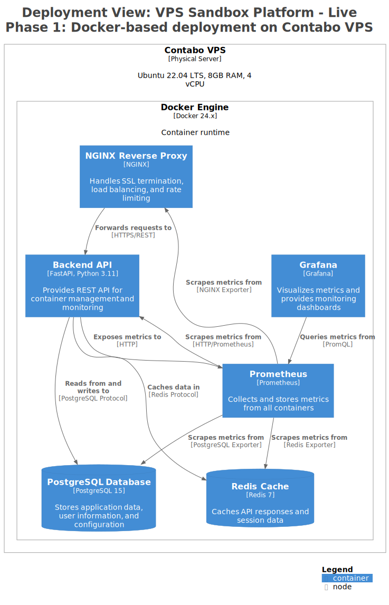
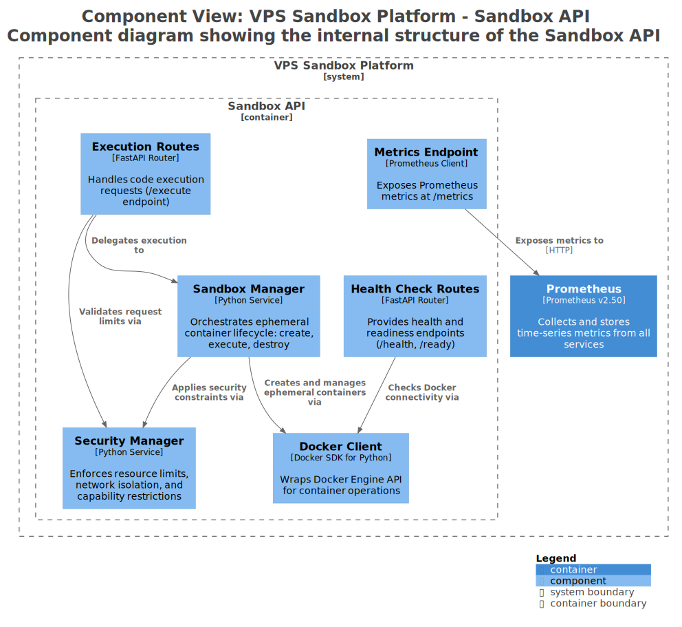

# VPS Demo Sandbox Platform

> A secure, production-grade sandboxed code execution platform. **[View source on GitHub](https://github.com/christosm-dev/portfolio/tree/main/vps-sandbox-platform)**

## Project Overview

This platform enables portfolio visitors to execute code examples in isolated, secure environments. It showcases DevOps, SRE, and Platform Engineering skills through real-world infrastructure automation, containerization, observability, and security practices - all running on a production VPS.

## Technology Stack

| Technology | Role |
|------------|------|
| FastAPI (Python 3.11) | REST API for sandboxed code execution |
| Docker / Docker Compose | Container runtime and service orchestration |
| Traefik v3 | Reverse proxy, SSL termination, service discovery |
| Prometheus | Metrics collection from all services |
| Grafana | Unified dashboards for metrics and log visualisation |
| Loki + Promtail | Log aggregation and collection |
| Portainer CE | Web-based Docker management UI |
| Terraform | Infrastructure provisioning |
| Let's Encrypt / Cloudflare | SSL/TLS certificates via DNS challenge |

## Architecture

> C4 diagrams generated from [workspace.dsl](../vps-sandbox-c4-architecture/workspace.dsl) using the Structurizr DSL.

### System Context



### Container Diagram



### Docker Deployment (Current)



### Component Detail (Sandbox API)



## Live Services

| Service | URL | Authentication |
|---------|-----|----------------|
| Sandbox API | https://api.christosm.dev | None (public) |
| Grafana | https://grafana.christosm.dev | Grafana login |
| Prometheus | https://prometheus.christosm.dev | Basic auth |
| Traefik Dashboard | https://traefik.christosm.dev | Basic auth |
| Portainer | https://portainer.christosm.dev | Portainer login |

## Security Features

### Container Isolation
- **Network Isolation**: `network_mode: none` - containers have no network access
- **Read-only Root**: Filesystem is read-only except for `/tmp` (50MB limit)
- **Capability Dropping**: All Linux capabilities dropped with `cap_drop: ALL`
- **No New Privileges**: Prevents privilege escalation
- **Process Limits**: Maximum 50 processes per container

### Resource Constraints
- **CPU**: Limited to 50% of one core
- **Memory**: Hard limit of 256MB (no swap)
- **Execution Time**: 30-second timeout (configurable)
- **Output Size**: 10KB maximum output

### Application Security
- **Rate Limiting**: 10 requests per 60 seconds per IP address
- **Input Validation**: Code length limits, dangerous pattern detection
- **Automatic Cleanup**: Containers removed after execution
- **Logging**: All executions logged with metadata

## API Reference

### Base URL

Local: `http://localhost:8000` | Production: `https://api.christosm.dev`

### Endpoints

| Method | Path | Description |
|--------|------|-------------|
| `GET` | `/health` | Health check (Docker availability, active containers) |
| `GET` | `/environments` | List supported execution environments (Python, Node, Bash) |
| `POST` | `/execute` | Execute code in sandboxed container |
| `GET` | `/stats` | Platform statistics (active executions, rate limits) |

### Execute Request

```json
{
  "code": "print('Hello, World!')",
  "environment": "python",
  "timeout": 30
}
```

### Execute Response

```json
{
  "execution_id": "uuid",
  "status": "success",
  "output": "Hello, World!\n",
  "error": null,
  "execution_time": 0.523,
  "environment": "python"
}
```

## Monitoring and Observability

| Component | Role | Retention |
|-----------|------|-----------|
| **Prometheus** | Metrics collection (Traefik, Sandbox API, Loki) | 15 days |
| **Loki** | Log aggregation (container + host logs) | 15 days (360h) |
| **Promtail** | Log collection agent (Docker SD + host syslog/auth) | N/A |
| **Grafana** | Visualization and dashboards | Persistent |

### Prometheus Scrape Targets

- `prometheus:9090` - Self-monitoring
- `traefik:8080` - Reverse proxy metrics
- `sandbox-api:8000` - Application metrics
- `loki:3100` - Log aggregation metrics

## Codebase Overview

```
vps-sandbox-platform/
├── backend/
│   ├── main.py              # FastAPI application: routes, sandbox manager, security
│   ├── Dockerfile           # Python 3.11 container image
│   └── requirements.txt     # Python dependencies (FastAPI, Docker SDK, Prometheus client)
├── terraform/
│   ├── main.tf              # Infrastructure provisioning: Docker, firewall, deployment
│   └── terraform.tfvars.example  # Example variables (VPS host, SSH key path)
├── monitoring/
│   ├── prometheus/           # Prometheus configuration and scrape targets
│   ├── grafana/              # Grafana datasources and dashboard provisioning
│   ├── loki/                 # Loki storage and schema configuration
│   └── promtail/             # Promtail Docker SD and host log pipelines
├── frontend-integration/
│   └── example.html          # Vanilla JS example for API integration
├── docs/
│   ├── DEPLOYMENT.md         # VPS deployment guide
│   ├── SECURITY.md           # Security architecture documentation
│   └── KUBERNETES_MIGRATION.md  # Planned K8s migration strategy
├── images/                   # C4 architecture diagrams (SVG)
├── docker-compose.yml        # Full service stack definition
├── .env.example              # Required environment variables template
├── GETTING_STARTED.md        # Local development setup guide
├── ROADMAP.md                # Detailed project roadmap
├── test_client.py            # Interactive API test client
└── README.md                 # This file
```

## Future Work

### Kubernetes Migration
- Namespace-based isolation
- ResourceQuotas and LimitRanges
- NetworkPolicies for enhanced security
- Horizontal Pod Autoscaling

### Advanced Security
- gVisor runtime for enhanced isolation
- Seccomp and AppArmor profiles
- Admission webhooks for policy enforcement
- Secret management with Vault

### Monitoring & Observability
- ~~Prometheus metrics~~ Implemented
- ~~Grafana dashboards~~ Implemented
- ~~Log aggregation~~ Implemented (Loki + Promtail)
- Distributed tracing with Jaeger
- Alertmanager for alert routing

### Developer Experience
- WebSocket for real-time output
- Multi-file execution support
- Package installation support
- Collaborative features

## Resources

- [Traefik Documentation](https://doc.traefik.io/traefik/)
- [Terraform Docker Provider](https://registry.terraform.io/providers/kreuzwerker/docker/latest/docs)
- [gVisor Container Security](https://gvisor.dev/)
- [Kubernetes Multi-tenancy](https://kubernetes.io/docs/concepts/security/multi-tenancy/)
- [Loki Documentation](https://grafana.com/docs/loki/latest/)
- Portfolio: [christosm.dev](https://christosm.dev)
